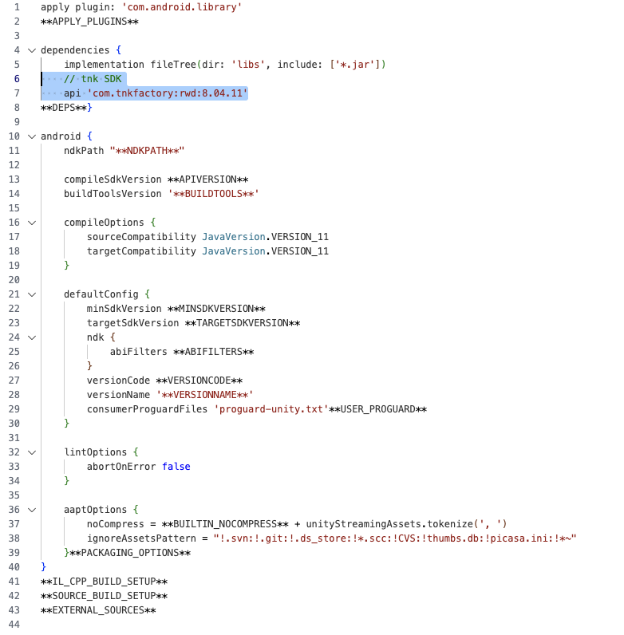
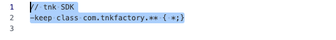

# Unity Plugin Guide

## 목차

1. [Unity Settings](#1-unity-settings)
    * [Plugin Download](#plugin-download)
    * [Plugin Import](#plugin-import)
    * [gradleTemplate.properties 설정](#gradletemplateproperties-설정)
    * [baseProjectTemplate.gradle 설정](#baseprojecttemplategradle-설정)
    * [mainTemplate.gradle 설정](#maintemplategradle-설정)
    * [AdnroidMenifest.xml 설정](#adnroidmenifestxml-설정)
        * [Permission 설정](#permission-설정)
        * [Tnk App ID 설정](#tnk-app-id-설정)
        * [UnityPlayer](#unityplayer-설정)

2. [Analytics Report](#4-analytics-report)

    * [기본 설정](#기본-설정)
    * [필수 호출](#필수-호출)
        * [TnkSession.applicationStarted()](#tnkadplugin---applicationstarted)
    * [사용 활동 분석](#사용-활동-분석)
        * [TnkSession.actionCompleted()](#tnkadplugin---actioncompleted)
    * [구매 활동 분석](#구매-활동-분석)
        * [TnkSession.buyCompleted()](#tnkadplugin---buycompleted)
    * [사용자 정보 설정](#사용자-정보-설정)


## 1. Unity Settings

### Plugin Download

Tnk에서 제공하는 tnkad-rwd.unitypackage 파일을 다운 받습니다.

**[[Unity Plugin Download v8.04.11](./sdk/tnk_unity_plugin.zip)]**

적용 할 Unity 프로젝트를 연 상태에서 다음 이미지와 같이 프로젝트의 Packages폴더를 오른 클릭 후 폴더를 열어주세요


해당 폴더에 다운받은 tnk sdk파일을 복사합니다.


위 이미지와 같이 

### Plugin Setting

다음과 같이 안드로이드 빌드 설정 파일을 설정 해야합니다.

1. 설정에서 build and setting 메뉴를 선택합니다.


2. player settings 메뉴를 선택합니다.


3. other settings 메뉴를 선택 후 min sdk와 target sdk를 설정합니다.
(구글 정책 준수를 위해 2023년 11월 기준 target sdk 33이상으로 설정 하셔야 합니다. min sdk 권장은 21입니다.)


4. publishing settings 메뉴를 선택 후 다음 이미지의 설정을 참고하여 설정합니다.


설정 파일들을 열고 다음과 같은 설정을 추가해주세요.

### gradleTemplate.properties 설정

gradleTemplate.properties 파일에 AndroidX 설정을 추가해주세요.

```gradle
android.useAndroidX=true
android.enableJetifier=true
```


### baseProjectTemplate.gradle 설정

baseProjectTemplate.gradle 파일에 maven repository를 추가해주세요.

```gradle
repositories {
    // tnk repository
    maven { url "https://repository.tnkad.net:8443/repository/public/" }
}
```


### mainTemplate.gradle 설정

mainTemplate.gradle 파일에 TNK SDK 설정을 추가해주세요.

```gradle
dependencies {
    api 'com.tnkfactory:rwd:8.04.11'
}
```



### AdnroidMenifest.xml 설정

기존에 작성하신 AndroidMenifest.xml 파일에 아래 코드 중 주석으로 되어 있는 부분의 설명을 확인하시고 본인의 AndroidMenifest.xml 파일에 반영해주세요.

> ##### TnkAdAndroidMenifest.xml

```xml
<?xml version="1.0" encoding="utf-8"?>
<manifest 
  xmlns:android="http://schemas.android.com/apk/res/android" 
  package="your.package.name" 
  android:theme="@android:style/Theme.NoTitleBar" 
  android:versionName="1.0" 
  android:versionCode="1" 
  android:installLocation="preferExternal">
  
  <supports-screens 
    android:smallScreens="true" 
    android:normalScreens="true" 
    android:largeScreens="true" 
    android:xlargeScreens="true" 
    android:anyDensity="true" />
  
  <!-- permissions for TnkAd -->
   <uses-permission android:name="android.permission.INTERNET" />
   <uses-permission android:name="android.permission.ACCESS_WIFI_STATE" />
   <uses-permission android:name="com.google.android.finsky.permission.BIND_GET_INSTALL_REFERRER_SERVICE"/>
   <uses-permission android:name="com.google.android.gms.permission.AD_ID"/>
  
  <application 
    android:icon="@drawable/app_icon" 
    android:label="@string/app_name">

    <activity 
      android:label="@string/app_name" 
      android:screenOrientation="portrait" 
      android:launchMode="singleTask" 
      android:configChanges="mcc|mnc|locale|touchscreen|keyboard|keyboardHidden|navigation|orientation|screenLayout|uiMode|screenSize|smallestScreenSize|fontScale" 
      android:name="com.unity3d.player.UnityPlayerNativeActivity" android:exported="true">

      <intent-filter>
        <action android:name="android.intent.action.MAIN" />
        <category android:name="android.intent.category.LAUNCHER" />
      </intent-filter>

      <meta-data android:name="unityplayer.UnityActivity" android:value="true" />
      <meta-data android:name="unityplayer.ForwardNativeEventsToDalvik" android:value="true" /> <!-- set true -->
    </activity>
    
    <!-- TnkAd  Offerwall Activities -->
     <activity android:name="com.tnkfactory.ad.AdWallActivity"
             android:theme="@style/Theme.AppCompat.DayNight.NoActionBar"
             android:exported="true"
             android:screenOrientation="portrait"/>
    
    <!-- Set your Tnk App_ID here -->
    <meta-data android:name="tnkad_app_id" android:value="your-appid-from-tnk-site" />
  </application>
  
  <uses-feature android:glEsVersion="0x00020000" />
  <supports-gl-texture android:name="GL_OES_compressed_ETC1_RGB8_texture" />
</manifest>
```


#### Permission 설정

TnkAd SDK 가 필요로 하는 permission을 아래와 같이 설정합니다.

```xml
<uses-permission android:name="android.permission.INTERNET" />
<uses-permission android:name="android.permission.ACCESS_WIFI_STATE" />
<uses-permission android:name="com.google.android.finsky.permission.BIND_GET_INSTALL_REFERRER_SERVICE"/>
<uses-permission android:name="com.google.android.gms.permission.AD_ID"/>
```

#### Tnk App ID 설정

Tnk 사이트에서 앱 등록하면 상단에 App ID 가 나타납니다. 이를 AndroidMenifest.xml 파일의 <application> tag 안에 아래와 같이 설정합니다.

(*your-application-id-from-tnk-site* 부분을 실제 App ID 값으로 변경하세요.)

```xml
<application>

     ...

    <meta-data android:name="tnkad_app_id" android:value="your-application-id-from-tnk-site" />

</application>
```

#### Offerwall Activity 설정

Offerwall Activity는 보상형 광고목록이 출력되는 Activity입니다. 매체앱으로서 충전소 기능을 탑제하시려면 아래의 <activity/> 설정을 추가하셔야합니다.

```xml
<activity android:name="com.tnkfactory.ad.AdWallActivity"
        android:theme="@style/Theme.AppCompat.DayNight.NoActionBar"
        android:exported="true"
        android:screenOrientation="portrait"/>
```

#### UnityPlayer 설정

Unity 4.3 이상 버전을 사용하신다면 아래와 같이 ForwardNativeEventsToDalvik 옵션을 true로 설정하셔야 화면에 touch 이벤트가 동작합니다. 매체앱으로서 전면 중간광고 창을 띄우고자 하신다면 반드시 아래와 같이 설정해주세요. 광고만 진행하시는 경우에는 설정하실 필요가 없습니다.

```xml
<activity 
  android:label="@string/app_name" 
  android:screenOrientation="portrait" 
  android:launchMode="singleTask" 
  android:configChanges="mcc|mnc|locale|touchscreen|keyboard|keyboardHidden|navigation|orientation|screenLayout|uiMode|screenSize|smallestScreenSize|fontScale" 
  android:name="com.tnkfactory.spaceshootler.UnityPlayerNativeActivity" android:exported="true">

  <intent-filter>
    <action android:name="android.intent.action.MAIN" />
    <category android:name="android.intent.category.LAUNCHER" />
  </intent-filter>

  <meta-data android:name="unityplayer.UnityActivity" android:value="true" />
  <meta-data android:name="unityplayer.ForwardNativeEventsToDalvik" android:value="true" /> <!-- set true -->
</activity>
```

### proguard 설정

proguard-user.txt 파일에 아래 코드를 추가해주세요.

```proguard
// tnk SDK
-keep class com.tnkfactory.** { *;}
```




## 2. Analytics Report

Analytics 적용을 위해서는 Tnk 사이트에서 앱 등록 및 프로젝트 상의 SDK 관련 설정이 우선 선행되어야합니다.

[[Unity Settings](#1-unity-settings)]의 내용을 우선 확인해주세요.

### 기본 설정

AndroidMenifest.xml 파일 내에 Tnk 앱 등록세 발급 받은 App ID를 설정하시고 그 아래에 아래와 같이 tnkad_tracking 값을 true로 설정합니다.

이후 더 이상 tracking을 원하지 않을 경우에는 false로 설정하시기 바랍니다.

```xml
<application>
    ...
    <meta-data android:name="tnkad_app_id"  android:value="your-app-id-from-tnk-sites" />
    <meta-data android:name="tnkad_tracking" android:value="true" />
    ...
</application>
```

SDK가 요구하는 permission들을 추가합니다.

\- 앱의 유입 경로 기능을 사용하기 위해서는 BIND_GET_INSTALL_REFERRER_SERVICE 권한은 필수입니다.

```xml
<application>
    <uses-permission android:name="android.permission.INTERNET" />

    <uses-permission android:name="android.permission.ACCESS_WIFI_STATE" />

    <uses-permission android:name="com.google.android.finsky.permission.BIND_GET_INSTALL_REFERRER_SERVICE" />
</application>
```

전체적인 AndroidMenifest 파일의 모습은 아래와 같습니다.

```xml
<manifest xmlns:android="http://schemas.android.com/apk/res/android" package="your.package.name" >

    <uses-permission android:name="android.permission.INTERNET" /> 
    <uses-permission android:name="android.permission.ACCESS_WIFI_STATE" />
    <uses-permission android:name="com.google.android.finsky.permission.BIND_GET_INSTALL_REFERRER_SERVICE" />
   

    <application android:icon="@drawable/ic_launcher" android:label="@string/app_name"> 

        ... your activities ...

 

        <meta-data android:name="tnkad_app_id" android:value="your-app-id-from-tnk-sites" />

        <meta-data android:name="tnkad_tracking" android:value="true" />    

    </application>

</manifest> 
```

### 필수 호출

앱이 실행되는 시점에 TnkSession.applicationStarted()를 호출합니다. 필수적으로 호출해야하는 API 이며 이것만으로도 사용자 활동 분석을 제외한 대부분의 분석 데이터를 얻으실 수 있습니다.

#### TnkAd.Plugin - applicationStarted()

##### Method

- void applicationStarted()

##### Description

앱이 실행되는 시점에 호출합니다. 다른 API 보다 가장 먼저 호출되어야 합니다.

##### 적용 예시

```c#
TnkAd.Plugin.Instance.applicationStarted();
```

### 사용 활동 분석

사용자가 앱을 설치하고 처음 실행했을 때 어떤 행동을 취하는지 분석하고자 할 때 아래의 API를 사용합니다.

예를 들어 로그인, 아이템 구매, 친구 추천 등의 행동이 이루어 질때 해당 행동에 대한 구분자와 함께 호출해주시면 사용자가 어떤 패턴으로 앱을 이용하는지 또는 어떤 단계에서 많이 이탈하는지 등의 분석이 가능해집니다.

#### TnkAd.Plugin - actionCompleted()

##### Method

- void actionCompleted(string actionName)

##### Description

사용자의 특정 액션 발생시 호출합니다.

동일 액션에 대해서는 최초 발생시에만 데이터가 수집됩니다.

##### Parameters

| 파라메터 명칭 | 내용                                                         |
| ------------- | ------------------------------------------------------------ |
| actionName    | 사용자 액션을 구별하기 위한 문자열 (예를 들어 "user_login" 등) 사용하시는 actionName 들은 모두 Tnk 사이트의 분석보고서 화면에서 등록되어야 합니다. |

##### 적용 예시

```c#
// 추가 데이터 다운로드 완료시 
TnkAd.Plugin.Instance.actionCompleted("resource_loaded");

// 회원 가입 완료시 
TnkAd.Plugin.Instance.actionCompleted("signup_completed");

// 프로필 작성 완료시 
TnkAd.Plugin.Instance.actionCompleted("profile_entered");

// 친구 추천시 
TnkAd.Plugin.Instance.actionCompleted("friend_invite"); 
```

### 구매 활동 분석

사용자가 유료 구매 등의 활동을 하는 경우 이에 대한 분석데이터를 얻고자 할 경우에는 아래의 API를 사용합니다.

구매활동 분석 API 적용시에는 유입경로별로 구매횟수와 구매 사용자 수 파악이 가능하며, 하루 사용자 중에서 몇명의 유저가 구매 활동을 하였는 지 또 사용자가 앱을 처음 실행한 후 얼마정도가 지나야 구매활동을 하는지 등의 데이터 분석이 가능합니다. 분석 보고서에서 제공하는 데이터에 각 아이템별 가격을 대입시키면 ARPU 및 ARPPU 값도 산출하실 수 있습니다.

#### TnkAd.Plugin - buyCompleted()

##### Method

- void buyCompleted(string itemName)

##### Description

사용자가 유료 구매를 완료하였을 때 호출합니다.

##### Parameters

| 파라메터 명칭 | 내용                                                        |
| ------------- | ----------------------------------------------------------- |
| itemName      | 구매한 item을 구별하기 위한 문자열 (예를 들어 "item_01" 등) |

##### 적용 예시

```c#
// item_01 구매 완료시 
TnkAd.Plugin.Instance.buyCompleted("item_01");

//item_02 구매 완료시
TnkAd.Plugin.Instance.buyCompleted("item_02");
```

### 사용자 정보 설정

사용자의 성별 및 나이 정보를 설정하시면 보고서에서 해당 내용이 반영되어 추가적인 데이터를 확인하실 수 있습니다.

```c#
// 나이 설정 
TnkAd.Plugin.Instance.setUserAge(23);

// 성별 설정 (남) 
TnkAd.Plugin.Instance.setUserGender(0);

// 성별 설정 (여) 
TnkAd.Plugin.Instance.setUserGender(1); 
```
